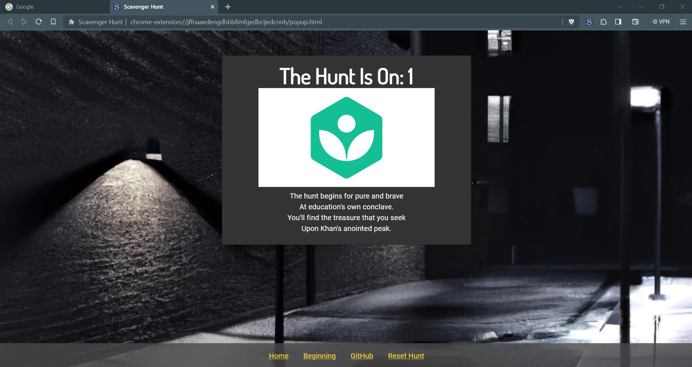
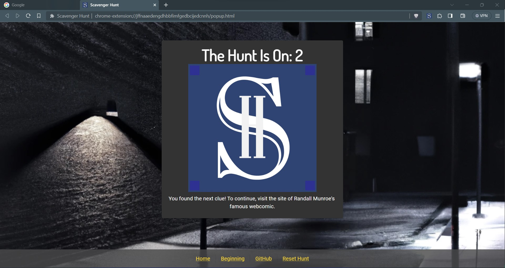

# Scavenger Hunt Extension

Create and solve scavenger hunts across the Internet. The sky is your limit!

Available on [Chrome Store](https://chrome.google.com/webstore/detail/scavenger-hunt/opcgbolmjikeaokbmldpfhemaamnfggf?hl=en-US)!

[YouTube Tutorial](https://youtu.be/O9CKn3I73Oc)

## Overview

A simple Chrome Extension to create a Scavenger Hunt for URLs based on [encoded json](res/hunt.json). Only load JSON hunts created by those you trust.

### Install

In order to run the Chrome Extension from this repo:

Build

- `git clone git@github.com:TylerJang27/Scav_Hunt_Extension.git`
- `npm install`
- `npm run build` (or `npm run watch` for development)

Install

- Go to `chrome://extensions`
- Enable Developer mode if necessary (top right)
- Load Unpacked, and select the `dist` folder in this repo
- Right click the extension manager (puzzle piece) and pin the Scavenger Hunt Extension
- Click on the Scavenger Hunt icon to begin

### Configuration

Upon installing the Chrome Extension, click on the Scavenger Hunt icon to begin. There, you will have the option to change the JSON source for the scavenger hunt. You can specify the sample hunt, JSON from a URL ([example](https://raw.githubusercontent.com/TylerJang27/Scav_Hunt_Extension/master/res/hunt.json)), or upload JSON directly. Click submit, and the hunt will begin!

When you finish a hunt, make sure to hit Reset Hunt in order to stop getting popups.

### Hunting

When the hunt begins, you will be directed to the hunt start page. From there, follow the clues! When you navigate to a page that contains a clue, a popup alert will appear and the extension icon will display a blue "1". Click on it to retrieve the clue! Depending on the clue type, you will either receive the next clue or have the option to answer a question. Note that you must wait for the page to load completely before you can click on the extension (_on YouTube in particular this may require a refresh_).

### Creating your Own Hunt

To make your own scavenger hunt:

1. Install the Extension
2. Click on the pinned Extension Icon
3. Click on the Create Your Own image link to take you to the creation menu
4. Create a hunt with clues and click Download

For feedback, please see this [survey](https://forms.gle/3ZhvtKasc3WZZF9V7)

## Hunt Schema

### Top Level

| Field Name    | Type             | Description                                            |
| ------------- | ---------------- | ------------------------------------------------------ |
| name\*        | String           | A concise name for your hunt. Displayed on clue pages. |
| description\* | String           | A longer metadata description                          |
| version\*     | String           | Currently, only `1.0` is supported                     |
| author\*      | String           | Your name                                              |
| encrypted\*   | Boolean          | Whether the hunt is encrypted or a draft               |
| background\*  | URL              | Image to use as the hunt background                    |
| options\*     | **Options**      | A set of hunt customization                            |
| beginning\*   | Multiline String | The first clue to be shown when users start your hunt  |
| clues\*       | **Clues**        | The clues to include in your hunt                      |

### Options Schema

| Field Name | Type    | Description                                                     |
| ---------- | ------- | --------------------------------------------------------------- |
| silent\*   | Boolean | Whether to suppress alerts when a clue is found (default false) |

### Clue Schema

| Field Name  | Type             | Description                                                                                                                       |
| ----------- | ---------------- | --------------------------------------------------------------------------------------------------------------------------------- |
| id\*        | Number           | Starting from 1, must increment by 1 for each clue                                                                                |
| url\*       | URL or Regex     | A regex pattern or URL include match used to check the current URL                                                                |
| text\*      | Multiline String | The clue to display when the above URL is visited. If interactive is set, will only be displayed after the correct key is entered |
| image       | URL              | An optional image to display when the above URL is visited                                                                        |
| alt         | String           | An alt text (and tooltip) to display for the above image                                                                          |
| interactive | Interactive      | An optional question and answer for the user to match before revealing text                                                       |

### Interactive Schema

| Field Name | Type   | Description                                                   |
| ---------- | ------ | ------------------------------------------------------------- |
| prompt     | String | An optional question to ask the user                          |
| key\*      | String | A case sensitive answer required before showing the clue text |

See the [sample files](public/res/) for examples.

### Encryption

The encryption used in the hunts is not cryptographically secure. It is mainly meant as a layer of obfuscation to prevent the user from reading the contents directly (or reading from Chrome storage). However, only hunts with `encrypted: false` can be reuploaded as drafts.

### References

The following resources were used to create this extension. Thank You :)

- kunal-mandalia's [Let's Write Code](https://github.com/shama/letswritecode/tree/master/how-to-make-chrome-extensions)
- Tomofumi Chiba's [Typescript Starter Setup](https://github.com/chibat/chrome-extension-typescript-starter/tree/master)
- bravemaster619's [YouTube Video Embedder](https://dev.to/bravemaster619/simplest-way-to-embed-a-youtube-video-in-your-react-app-3bk2)
- Some babel code based on caniuse.com
- Some images were created with the assistance of DALL·E 2
