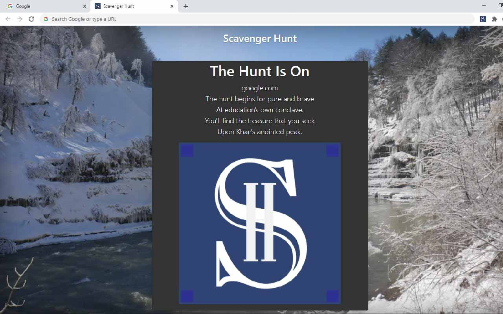
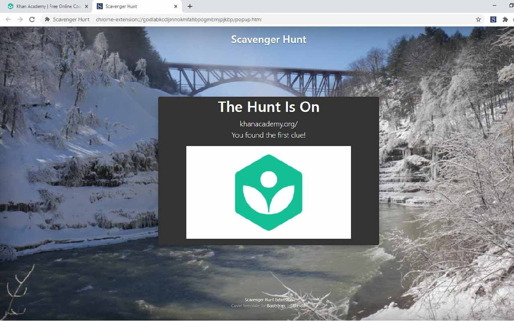

# Scav_Hunt_Extension

Creator: Tyler Jang |
Last Updated: 3/26/23 |
Status: Version 0.9.1

Available on [Chrome Store](https://chrome.google.com/webstore/detail/scavenger-hunt/opcgbolmjikeaokbmldpfhemaamnfggf?hl=en-US)

Additional User Guides coming soon!

## Overview

A simple Chrome Extension to create a Scavenger Hunt for URLs based on [encoded json](res/hunt.json). Only load JSON hunts created by those you trust.

[YouTube Tutorial](https://www.youtube.com/watch?v=yBkaL08VXWs)

### Install

In order to run the Chrome Extension from this repo:

Build

- `git clone git@github.com:TylerJang27/Scav_Hunt_Extension.git`
- `npm install`
- `npm run build` (or `npm run watch` for development)

Install

- Go to `chrome://extensions`
- Enable Developer mode if necessary (top right)
- Load Unpacked, and select the `dist` folder in this repo
- Right click the extension manager (puzzle piece) and pin the Scavenger Hunt Extension

### Configuration

Upon installing the Chrome Extension, right click on the extension icon (top right) and open up Options. There, you will have the option to change the JSON source for the scavenger hunt. You can specify the sample JSON, JSON from a URL ([example](https://raw.githubusercontent.com/TylerJang27/Scav_Hunt_Extension/master/res/hunt.json)), or upload JSON directly. Click submit, and the source will be configured!

### Hunting

<!-- TODO: TYLER GENERATE STARTER HUNTS -->
<!-- TODO: TYLER GENERATE PLUGIN SUPPORT -->

Navigate to the start of the hunt (contact the hunt creator for the start if a prompt does not appear, the default is `google.com`). When you navigate to a page that contains a clue for the first time, a popup alert will appear and the extension icon will display a blue "1". Click on it to retrieve the clue! Depending on the clue type, you will either receive the next clue or have the option to submit a key. Note that you must wait for the page to load completely before you can click on the extension.

### Customization and Development

To make your own scavenger hunt:

- Install the Extension,
- Navigate to the Extension's Options,
- Click on `Generate Hunt` to open a form and create a hunt.

To add more customization:

- Fork off of this branch,
- Edit [res/hunt.json](res/hunt.json) to include your clues and URLs, in accordance with the guidelines below,
- Add any additional HTML or image files in `res/`,
- Change the [popup.html](popup.html) and [hunt.css](hunt.css) files as you wish, and
- Have fun!

If you have an implementation change to this repository, feel free to submit a pull request and it will be reviewed.

For feedback, please see this [survey](https://forms.gle/3ZhvtKasc3WZZF9V7)

## JSON Guidelines

[1] denotes required, [2=_] denotes default value unless specified

See the sample files for examples.

### Top Level

<!-- TODO: TYLER DEVELOP A SCHEMA, INCLUDING A VERSION -->

The following top-level Key-Value Pairs should be included in the [json file](res/hunt.json).

- name (String) [2=Scavenger Hunt]
  - The name of the scavenger hunt
- description (String)
  - A description of the hunt
- version (String)
  - Version of the scavenger hunt file (used for encryption compatibility)
  - Currently 0.9
- author (String)
  - Author of the scavenger hunt
- encypted (Boolean) [2=false]
  - Whether or not the values in the json are encrypted (see below)
- background (String) [2=[Unsplash](https://unsplash.com/photos/J_xAScfz3EE)
  - A URL pointing to an image
- silent (Boolean) [2=false]
  - Whether or not you want alerts to be suppressed when a user finds a clue
- beginning (String)
  - A beginning text message to be displayed when a user chooses a hunt. Can use `\n`
- clues (List of Objects) [1]
  - The clues to be found along the trail
- show*progress: \_WORK IN PROGRESS*

### Clues

The following key-value pairs are expected as part of clue objects.

- id (Integer) [1]
  - The step of the clue. 0 denotes the starting point
- url (String/Regex) [1]
  - The URL Regex where the clue should be found. Do NOT inclue the https://
- text (String) [1 or html]
  - The text of the clue leading to the next step. Favored over HTML. Can use `\n`
- html (String) [1 or text]
  - An HTML file containing a clue. If specified and no text, interact will default to "always"
- image (String)
  - A path to an image (local or on web) to be displayed with the clue if text is present
- alt (String)
  - Alternative text to accompany an image if present
- interact (String) [2=always]
  - always: The clue will always be viewable as long as the user is at the correct URL
  - submit: The clue will require a user-submitted key in order to unlock
  - clickable: WORK IN PROGRESS
- prompt (String) [2=Enter key:]
  - A prompt for what the user should enter in the key box
- key (String) [1 if interact]
  - If interact is submit, a key to match (ignoring case) to view the next clue for a specified URL

### Encryption

Low-level base64 encryption is made available in order to prevent a curious user from poking the json. Note that a motivated user could still easily determine the json's contents. To generate the expected json, see the Chrome Extension options, where you will be able to fill out a [form](encode.html) and create it. You should indicate in the json whether or not encryption is enabled at the encryption key.

### References

The following resources were used to create this extension. Thank You :)

- kunal-mandalia's [Let's Write Code](https://github.com/shama/letswritecode/tree/master/how-to-make-chrome-extensions)
- [Javascript fetch tutorial](<https://www.javascripttutorial.net/javascript-fetch-api/#:~:text=The%20fetch()%20method%20returns,%2F%2F%20handle%20the%20error%20%7D>)
- [Javascript JSON fetch](https://daveceddia.com/unexpected-token-in-json-at-position-0/)
- [Creating Options](https://developer.chrome.com/extensions/options)
- [Error callbacks](https://stackoverflow.com/questions/51600832/how-to-make-chrome-downloads-api-wait-until-a-download-has-ended)
- Clue page built using [Bootstrap](https://getbootstrap.com/)
- [HTML Tables](<https://www.w3schools.com/jsref/met_tablerow_insertcell.asp#:~:text=Insert%20new%20row(s)%20at,cells%20in%20the%20new%20row.>)
- [Chrome Extension Downloads](https://stackoverflow.com/questions/4845215/making-a-chrome-extension-download-a-file/24162238)
- [Typescript Starter Setup](https://github.com/chibat/chrome-extension-typescript-starter/tree/master)
- Some images were created with the assistance of DALL·E 2
